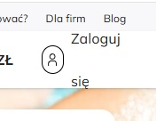
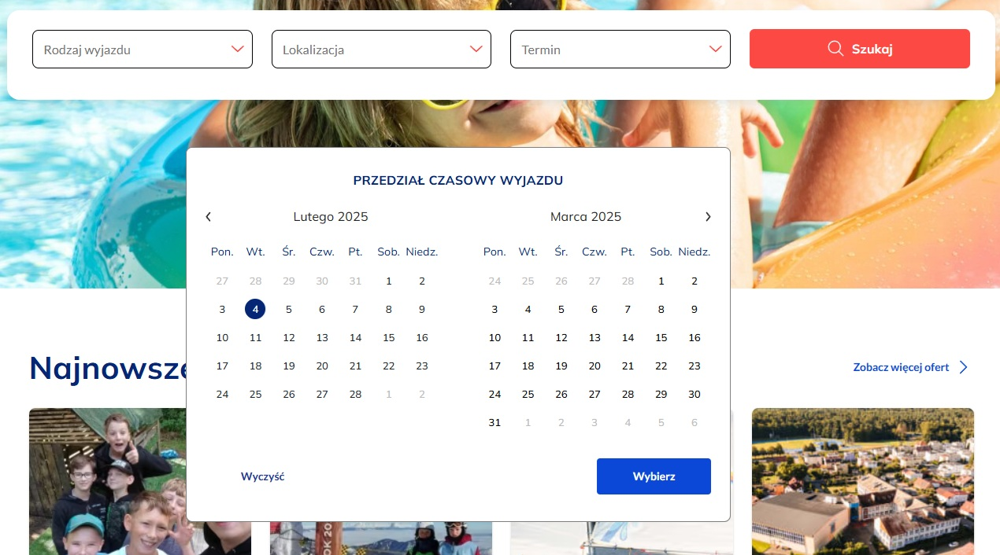
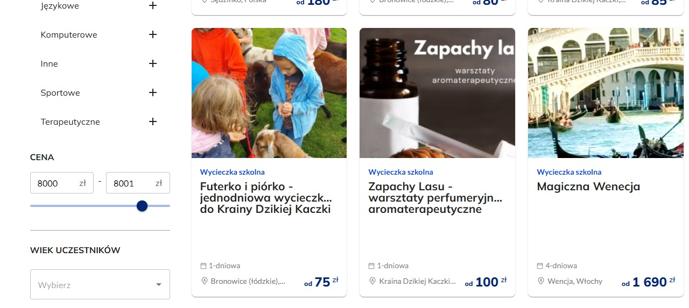
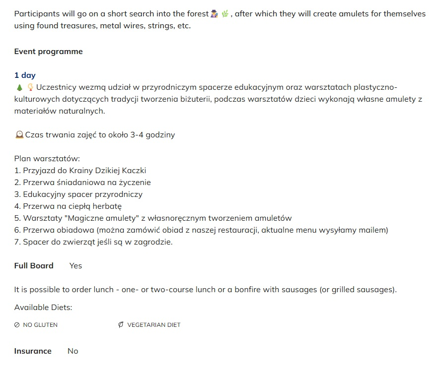
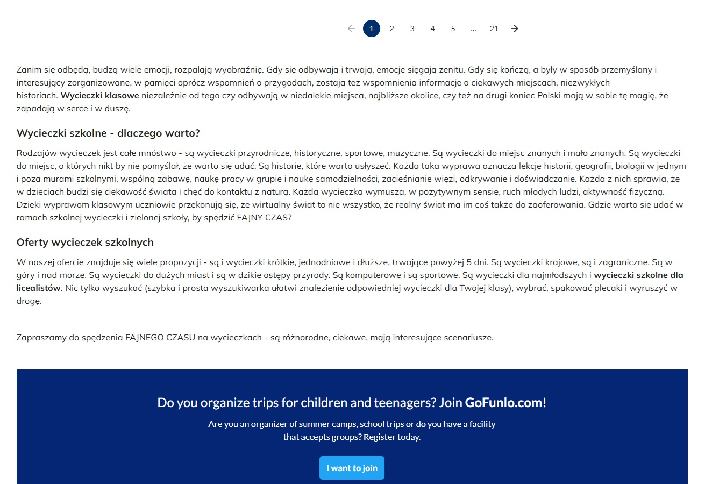

This is a [Next.js](https://nextjs.org) project bootstrapped with [`create-next-app`](https://nextjs.org/docs/app/api-reference/cli/create-next-app).

# Zadanie 1:

## Błędy na stronie:

1. "Zaloguj się" rozjeżdża się zarówno w wersji polskiej jak i angielskiej

2. Po kliknięciu na "Rodzaj wyjazdu" / "Lokalizacja" / "Termin" / Język / Walutę
oraz przescrollowaniu na dół, okienko się porusza, przez co zasłania oferty

3. Przedział cenowy nie jest zgodny z wynikami po przefiltrowaniu

4. Niektóre oferty w języku angielskim nadal mają polskie opisy (częściowo)

5.  Czasami opis pod listą wyników jest po polsku, mimo, że wybrany jest język angielski

